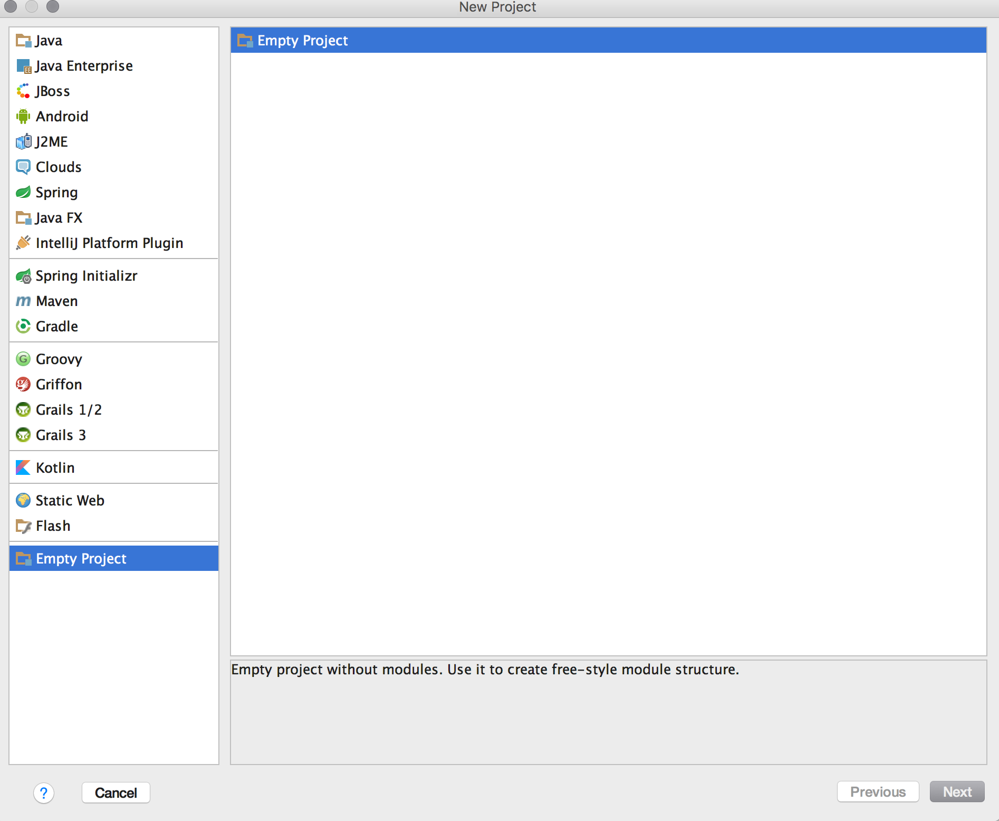
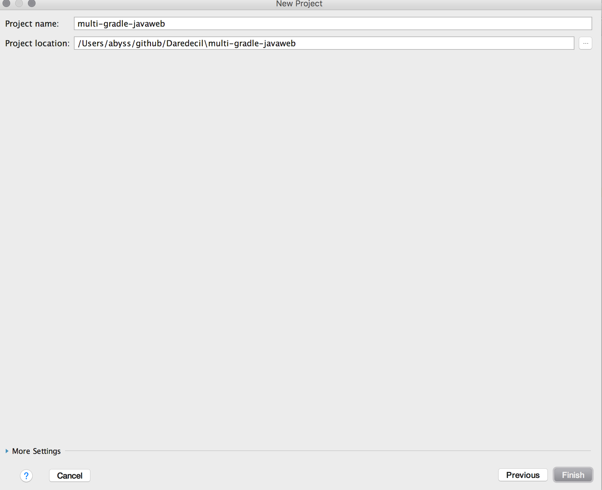
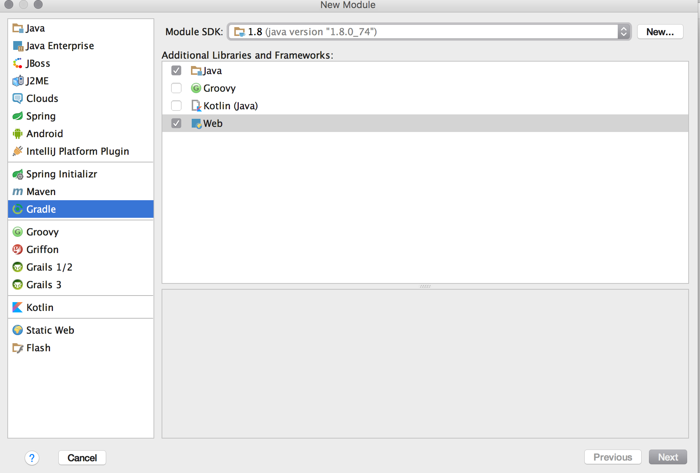
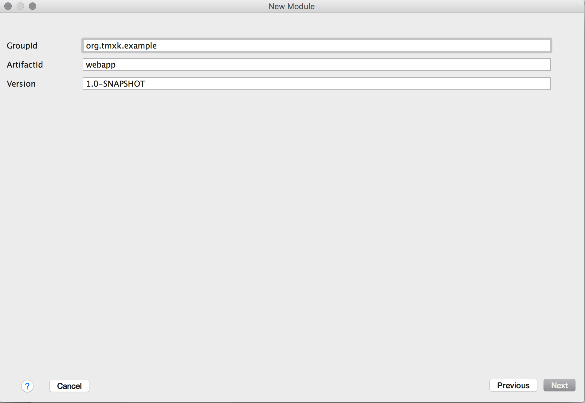
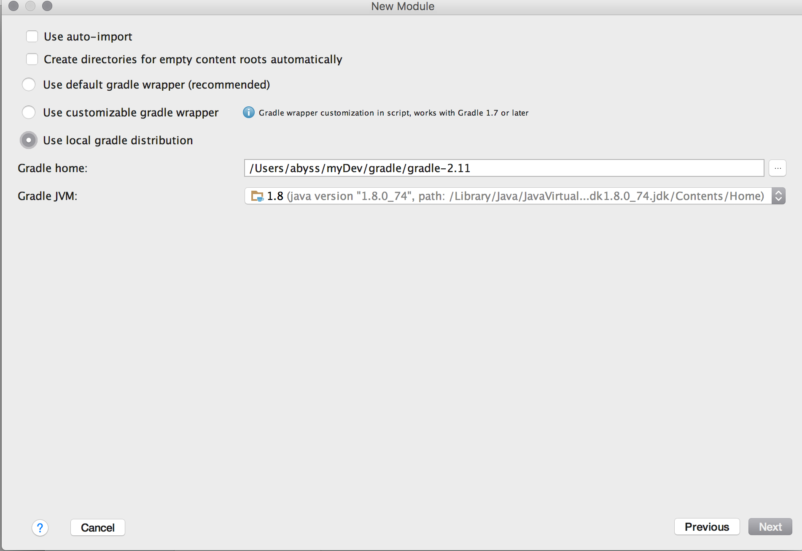
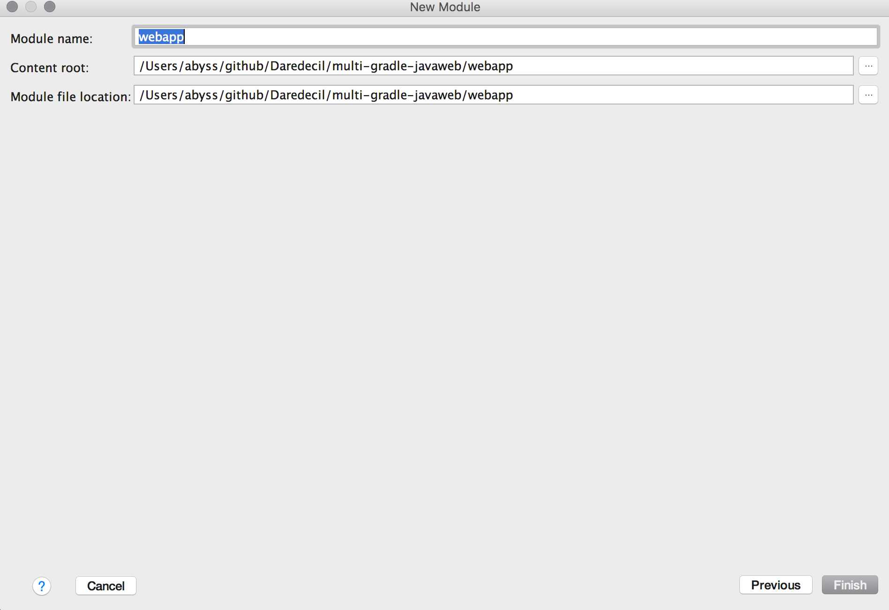
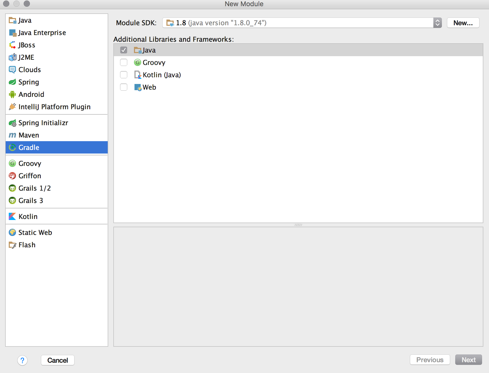
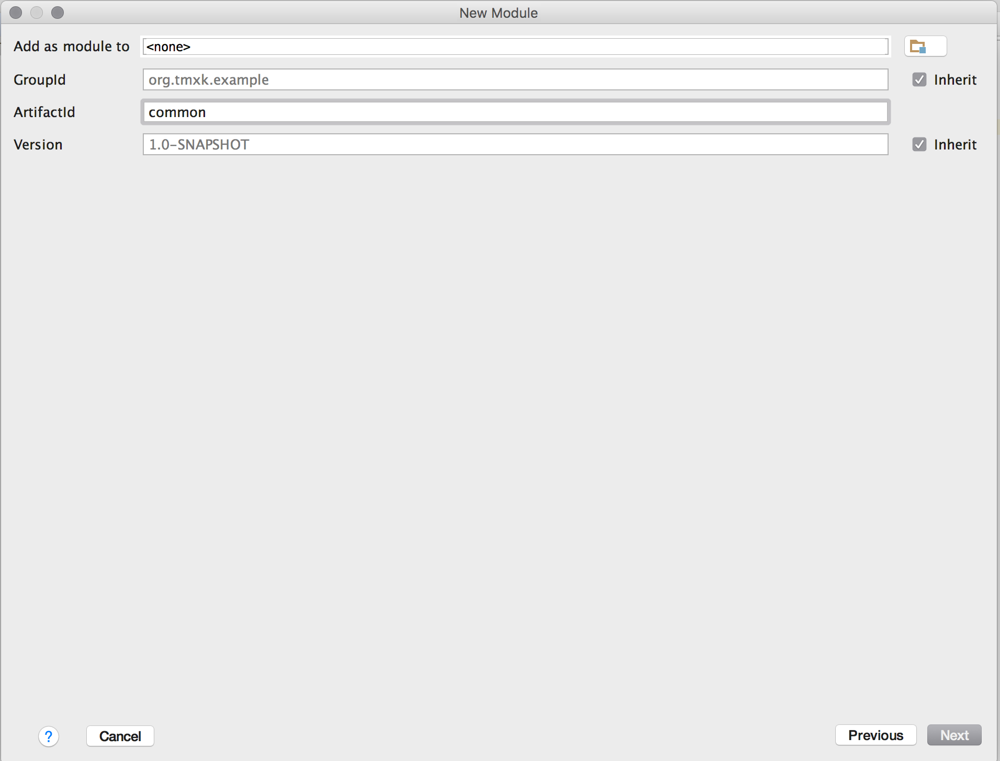

# 使用Gradle构建多模块的Java Web项目
> 该项目包含一个简单的JaveWeb模块和一个普通的Javase模块

# 先决条件
> Gradle 2.11
> IntelliJ Idea 15
> Mac 10.11
> Apache Tomcat 9M

# 构建步骤
> 按照如下图所示的步骤新建工程

1 新建一个空的工程;


2 新建一个web模块




3 新建一个普通的javase模块


4 将缺失的目录补全,然后在工程的根目录下新建build.gradle和settings.gradle文件
settings.gradle文件内容如下
```shell
rootProject.name = 'multi-gradle-javaweb'
include 'common'
include 'webapp'
```
build.gradle文件内容如下
```shell
subprojects {
    apply plugin: 'idea'
    apply plugin: 'java'

    group = 'science.freeabyss.template'
    version = '1.0-SNAPSHOT'

    sourceCompatibility = 1.8
    targetCompatibility = 1.8

    [compileJava, compileTestJava, javadoc]*.options*.encoding = 'UTF-8'

    repositories {
        mavenCentral()
    }

    dependencies {
        testCompile group: 'junit', name: 'junit', version: '4.11'
    }
}

```
如果common模块和Webapp模块下有settings.gradle文件,请删除.

__项目演示:__[https://github.com/freeabyss/Daredecil/tree/master/multi-gradle-javaweb](https://github.com/freeabyss/Daredecil/tree/master/multi-gradle-javaweb)


