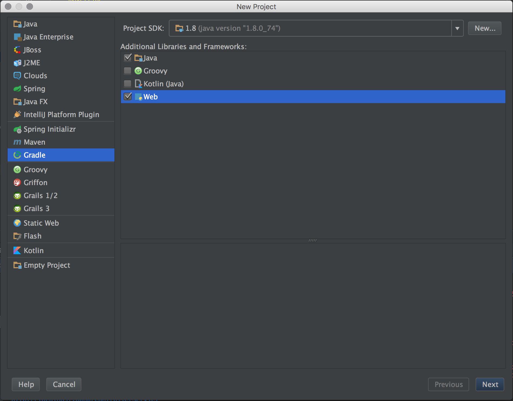
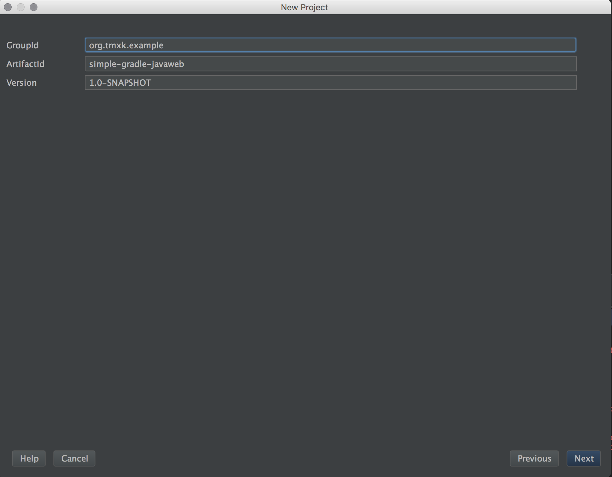
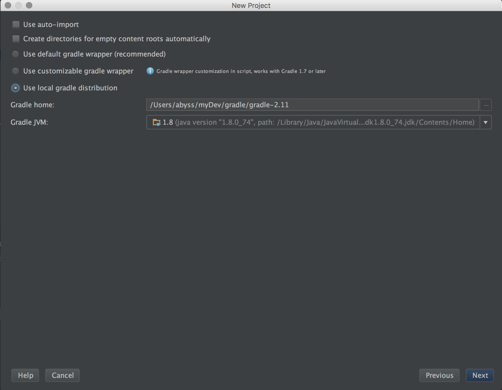
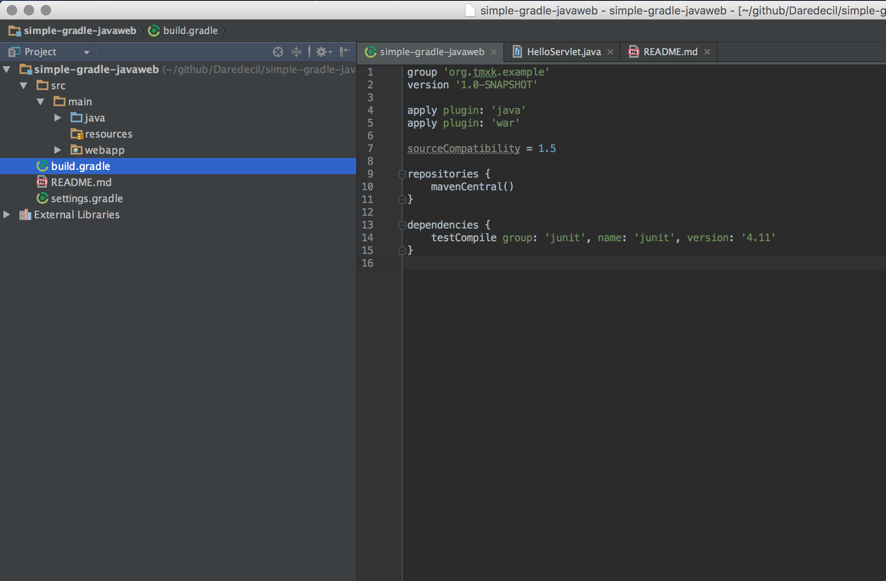
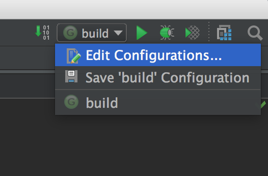
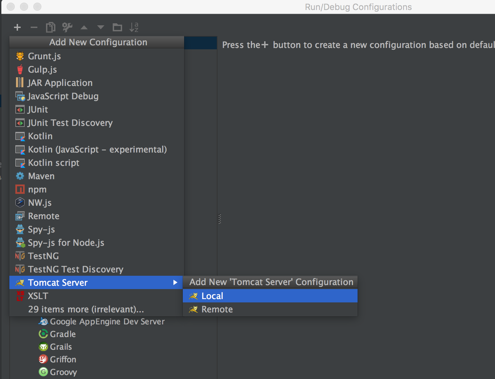
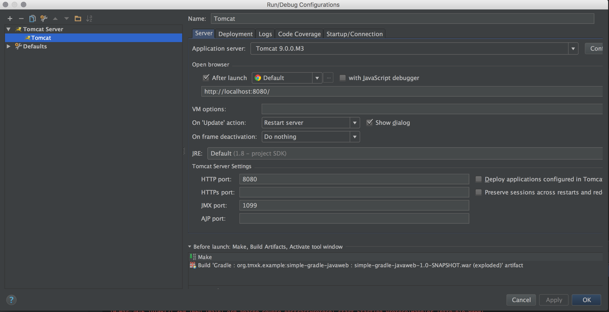
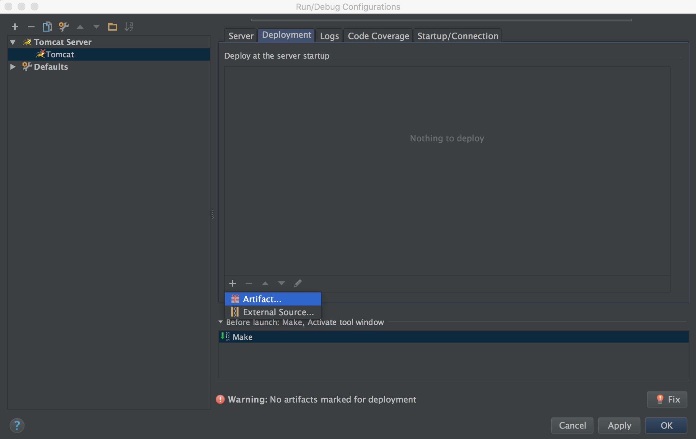
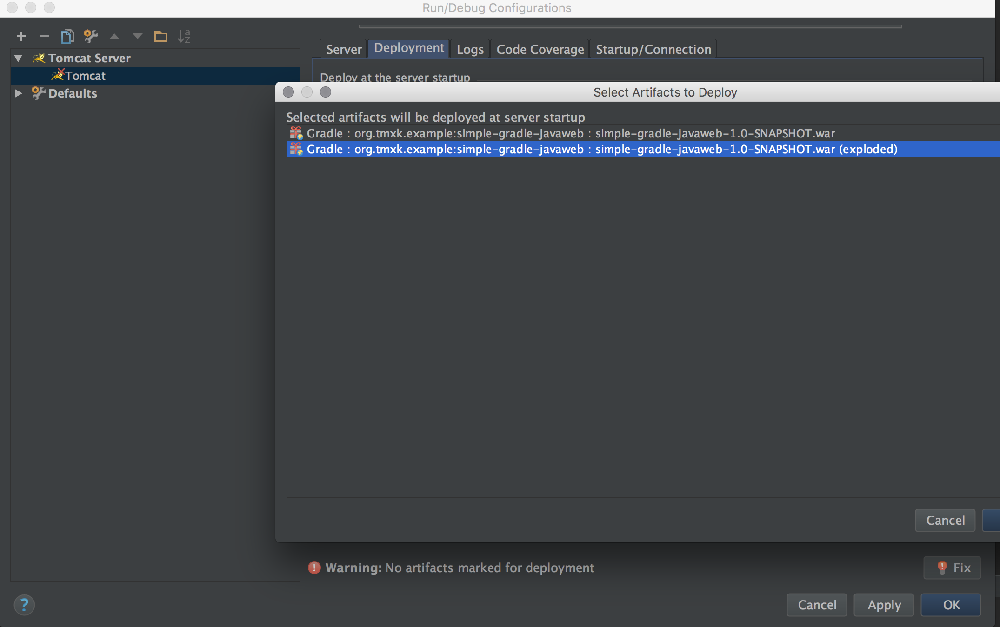

# 使用Gradle构建最简单的Java Web项目
>该项目仅包含Servlet，不包括其他任何框架

# 先决条件
> Gradle 2.11
> IntelliJ Idea 15
> Mac 10.11
> Apache Tomcat 9M

# 构建步骤
> 按照如下图所示的步骤新建工程



选择Gradle所在的目录

创建成功后，项目所下图所示


> 在main目录下创建java目录  
> 在main目录下创建resources目录  
> 在webapp目录下创建WEB-INF  
> 在WEB-INF目录下添加web.xml文件    
在builde.gradle文件中添加servlet依赖
```shell
providedCompile 'javax.servlet:servlet-api:3.0-alpha-1'
```
# 添加servlet代码
> 然后就是添加一个简单的servlet类进行测试，添加方法详见任何一个servlet教程。

# 部署到tomcat
> 点击idea右上角的图标  


点击左上角的＋号，选中Tomcat Server->Local

这里选择tomcat的目录，其余的默认即可

切换到Deployment标签页，点击左下角的＋号

选择war包

接下来点击OK，回到主界面运行程序。

# 常见问题
## 某些目录没有创建
> 例如java，test等目录没有自动创建。  
> 解决方法：按照标准的工程目录手动创建即可，gradle会自动关联。
> gradle 标准的工程目录   

>  + build  
>  + src/main/java  
>  + src/main/resources
>  + src/test/java
>  + src/test/resources
 
## 无法在类中引用依赖包
> 我一开始遇到几次这种问题，经测试发现是gradle无法连接maven库导致的。  
> 不过我本地有下载好的依赖依然存在这种问题。
> 暂时没有很好的解决方案，我一般重启idea就好了


